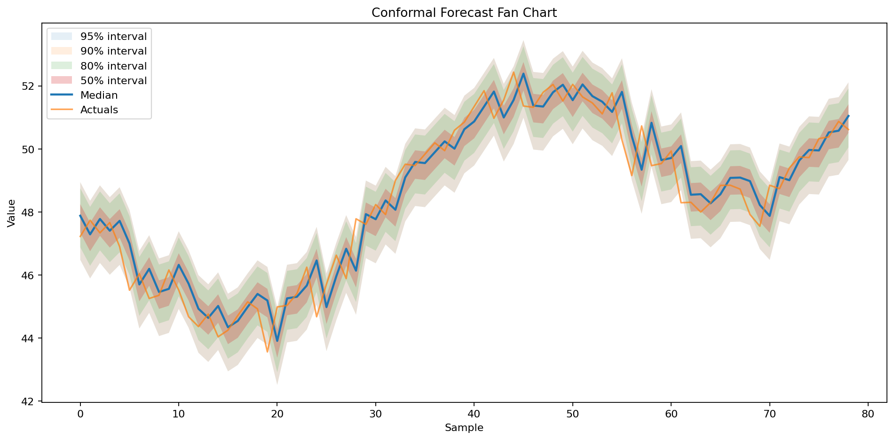

# Charting Guide

This guide shows the charting and distribution inspection workflow that `uncertainty_flow` supports today.

## What You Can Visualize

The main plotting surface is `DistributionPrediction.plot(...)`.

Today it supports:

- fan-chart style confidence bands
- a median line
- optional actual values overlaid on top
- custom confidence bands
- automatic downsampling for large prediction sets

It pairs naturally with:

- `interval()` for tabular lower and upper bounds
- `quantile()` for exact quantile columns
- `sample()` for Monte Carlo style draws from the predicted distribution

## Forecasting Example

For a charted example, forecasting is the better fit because the plotting API is most naturally read as a backtest-style sequence with intervals over ordered samples.

```python
import numpy as np
import polars as pl
from sklearn.linear_model import LinearRegression

from uncertainty_flow.wrappers import ConformalForecaster

rng = np.random.default_rng(42)
n = 400
t = np.arange(n)

df = pl.DataFrame(
    {
        "date": t,
        "value": 20 + 0.08 * t + 2.5 * np.sin(t / 8) + rng.normal(0, 0.5, n),
    }
)

train = df[:320]
test = df[320:]

model = ConformalForecaster(
    base_model=LinearRegression(),
    horizon=1,
    targets="value",
    lags=[1, 2, 3, 6, 12],
    random_state=42,
)
model.fit(train)

pred = model.predict(test)
```

`auto_tune` is enabled by default, so this fit will automatically pick from the model's lightweight built-in search space before the final fit.

The image below was generated from that workflow using the library's current `pred.plot(...)` implementation.



Caption: this is a held-out backtest-style forecast plot. The prediction bands and median are shown for rows in the test segment, and the actual series is overlaid for those same rows so you can visually inspect fit and calibration.

## Inspect The Distribution

Once you have `pred`, there are three especially useful inspection paths.

### 1. Prediction ranges

```python
interval_90 = pred.interval(0.9)
print(interval_90.head())
```

Typical output shape:

```text
┌──────────┬──────────┐
│ lower    ┆ upper    │
│ ---      ┆ ---      │
│ f64      ┆ f64      │
╞══════════╪══════════╡
│ 47.47    ┆ 49.54    │
│ 47.96    ┆ 50.03    │
│ 47.75    ┆ 49.83    │
└──────────┴──────────┘
```

### 2. Quantile slices

```python
quantiles = pred.quantile([0.1, 0.5, 0.9])
print(quantiles.head())
```

This is helpful when you want explicit bands instead of just a symmetric interval.

### 3. Sampled draws

```python
samples = pred.sample(100, random_state=42)
print(samples.head())
```

This gives you simulated draws from the predicted distribution for each input row, which is useful for downstream scenario analysis.

## Plot The Result

```python
pred.plot(
    actuals=test.tail(len(pred.mean()))["value"],
    confidence_bands=[0.5, 0.8, 0.9, 0.95],
    title="Conformal Forecast Fan Chart",
)
```

What this chart shows:

- darker inner bands for narrower intervals
- lighter outer bands for wider intervals
- the median prediction as a line
- actual values overlaid for quick visual calibration checks

In this forecasting example, the median line tracks the held-out sequence closely and the nested bands read naturally as a time-ordered uncertainty fan.

Because this is a backtest-style plot, the forecast region overlaps the actuals by design. It is not a recursive walk-forward chart that starts from the last training point and rolls into an unseen future horizon.

## Multivariate And Copula-Backed Ranges

Copula-backed dependence modeling matters for multi-target forecasting rather than tabular single-target regression.

For that workflow, the practical thing to inspect is usually the joint interval output:

```python
from uncertainty_flow.models import QuantileForestForecaster

model = QuantileForestForecaster(
    targets=["price", "volume"],
    horizon=7,
    copula_family="auto",
    random_state=42,
)
model.fit(train_df)
pred = model.predict(test_df)

joint_interval = pred.interval(0.9)
print(joint_interval.head())
```

Typical multivariate columns look like:

```text
price_lower  price_upper  volume_lower  volume_upper
```

That range output is the clearest user-facing sign that the model is producing multivariate uncertainty rather than independent per-target bounds.

## Current Limitations

- `plot()` currently visualizes the first target when predictions are multivariate.
- plotting requires `matplotlib`
- very large prediction sets are downsampled for readability

## Related Docs

- [./distribution-approach.md](./distribution-approach.md)
- [./models.md](./models.md)
- [./calibration.md](./calibration.md)
- [../api/spec.md](../api/spec.md)
